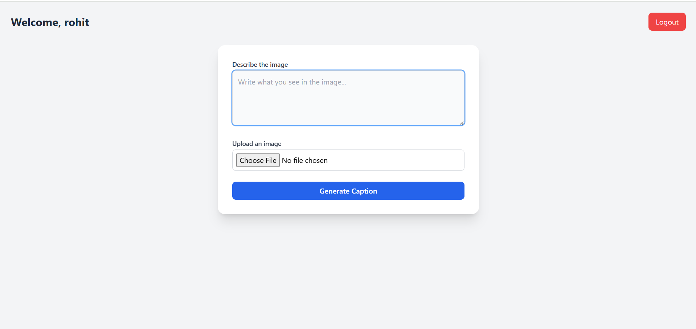
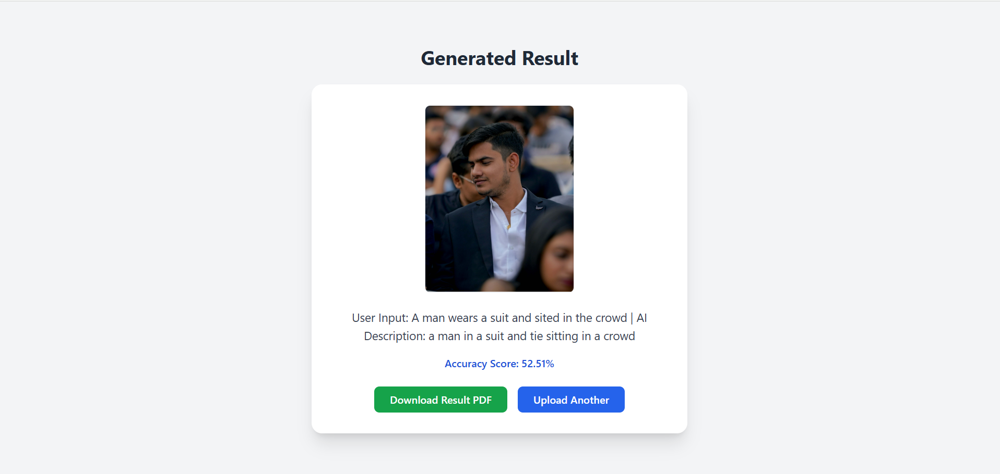

# 🧠 Text + Image Caption Analysis Platform

 <!-- Replace with actual banner path if available -->

A Flask-based NLP and Computer Vision platform that combines user-provided text with AI-generated image captions, calculates semantic similarity, and generates a downloadable PDF report. Includes secure user authentication, session management, and visit tracking.

---

## 🚀 Key Features

- 🔐 **User Authentication**: Secure login and registration system using MySQL.
- 🖼️ **Image Upload**: Uploads images to the platform and processes them using AI.
- 📝 **Captioning**: Uses BLIP (Bootstrapped Language-Image Pretraining) model to generate a caption from the uploaded image.
- 💬 **User Text Matching**: Compares user input with AI-generated caption using similarity score.
- 📄 **PDF Report**: Automatically generates and downloads a report of the results.
- 📊 **Visit Counter**: Counts total platform visits and displays it on the dashboard.
- 🗃️ **Database Storage**: Stores user interactions, results, and metadata for future reference.

---

## 🛠️ Technologies Used

- **Backend**: Python, Flask, MySQL
- **AI Model**: [BLIP Image Captioning](https://huggingface.co/Salesforce/blip-image-captioning-base)
- **Frontend**: HTML5, CSS3, Jinja2 Templates
- **Libraries**: Pillow (PIL), Transformers (HuggingFace), FPDF
- **Database**: MySQL
- **Other**: Session Management, Secure File Uploads

---

## 🖼️ Dashboard Preview

 <!-- Replace with actual screenshot if available -->


---

## 🔢 Visit Count Feature

Each time a user accesses the dashboard, the system automatically increments a **global visit counter** stored in the MySQL database. This counter is displayed in the dashboard UI to reflect total platform engagement.

```sql
CREATE TABLE visit_count (
  id INT PRIMARY KEY AUTO_INCREMENT,
  count INT DEFAULT 0
);
